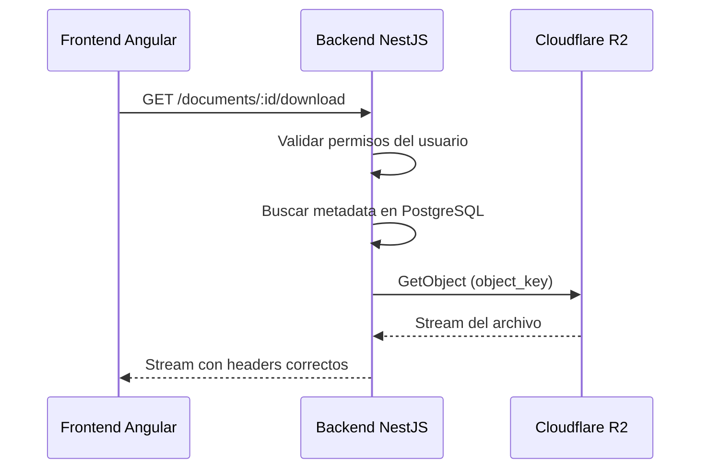
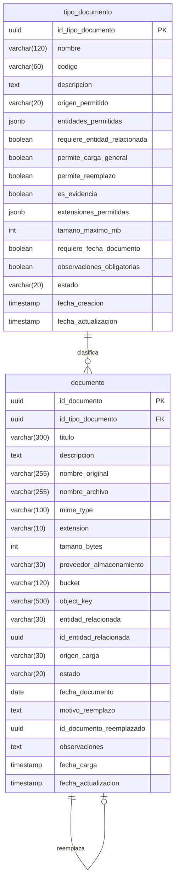
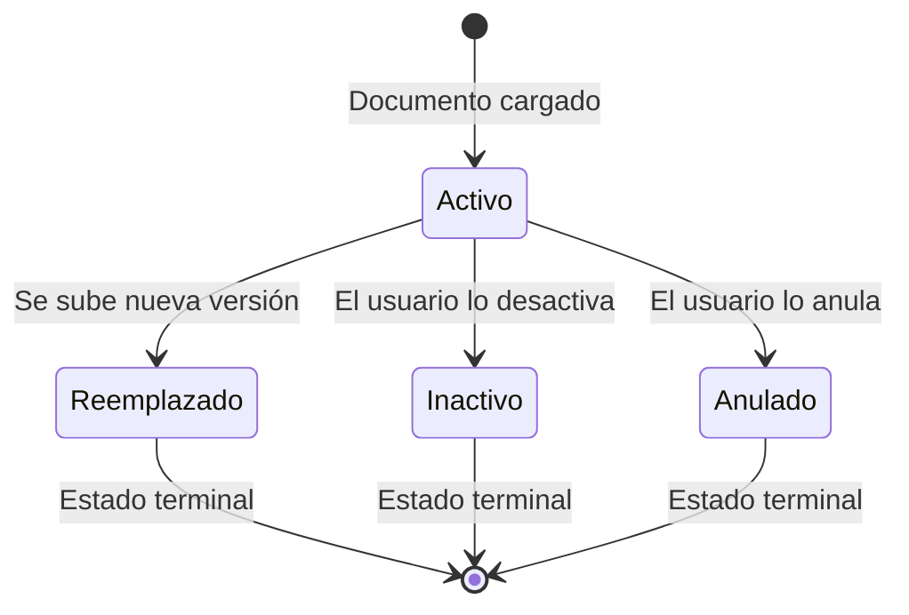

# Plan Técnico — Módulo de Gestión Documental del Sistema BADI

> **Versión:** 1.1  
> **Fecha:** 18 de junio de 2026  
> **Autor:** Luis (con asistencia de Antigravity)  
> **Alcance:** Diseño técnico completo para implementación por fases  
> **Estado:** Actualizado con estándar visual aprobado, precondiciones de Cloudflare R2 y control de alcance de implementación

---


## 0. Acuerdos Previos Antes de Implementar

Esta sección complementa el plan original y debe leerse antes de iniciar cualquier fase técnica. Su objetivo es evitar que Antigravity implemente el módulo completo sin control, que se creen estilos distintos a los ya aprobados, o que se manejen credenciales reales de Cloudflare R2 de forma insegura.

### 0.1 Estándar Visual Aprobado para Nuevos Formularios y Vistas

A partir de este módulo, **Gestión Documental debe usar como base visual el molde aprobado en el formulario “Registrar Nueva Organización”**. Ese piloto ya definió un criterio de interfaz más profesional para el sistema BADI, por lo que el nuevo módulo no debe volver a estilos improvisados, formularios con campos básicos o tablas sin jerarquía visual.

**Regla general:** las nuevas pantallas de Gestión Documental deben mantener coherencia con el estilo aprobado, aunque los módulos antiguos todavía queden pendientes de refactorización visual.

#### 0.1.1 Principios visuales obligatorios

| Elemento | Regla visual aprobada |
|---|---|
| **Breadcrumb / navegación** | Usar contenedor tipo píldora/caja con padding, borde suave, fondo claro, icono opcional y separador tipo chevron. No usar texto plano tipo `Organizaciones > Nueva Organización`. |
| **Encabezado de página** | Título fuerte, subtítulo descriptivo y separación visual antes del contenido. |
| **Cards / contenedores** | Usar padding suficiente, border-radius, borde suave y separación vertical entre secciones. Evitar bloques pegados. |
| **Formularios** | Usar campos consistentes, labels claros, errores inline y layout responsive. |
| **Selects / dropdowns** | Usar `appendTo="body"` cuando el panel pueda quedar recortado por cards/contenedores. Aplicar `panelStyleClass` para paneles profesionales. |
| **Mensajes de ayuda** | Evitar exceso de ejemplos debajo de campos. Mantener ayuda solo donde realmente aporta, como carga de archivos o redes sociales. |
| **Errores** | Mostrar snackbar inmediato, marcar el campo afectado y hacer scroll/focus al campo cuando aplique. No dejar errores solo arriba de la pantalla. |
| **Snackbars** | Usar estilos BADI para success, warning, error e info. Evitar botones vacíos o bloques negros. |
| **Búsqueda y filtros** | Usar barras de búsqueda con diseño integrado: borde suave, icono alineado, focus verde BADI y responsive. |
| **Estados vacíos** | Mostrar mensajes útiles y visualmente cuidados. No usar solo texto plano. |

#### 0.1.2 Componentes visuales recomendados

- **PrimeNG** para formularios nuevos: `InputText`, `Select`, `Textarea`, `IftaLabel` o `FloatLabel`, según convenga.
- **Angular Material** se mantiene para diálogos, snackbars, iconos, datepickers y componentes ya estables.
- No migrar de golpe los módulos antiguos. El nuevo módulo debe nacer con el estándar visual actual y los módulos anteriores se ajustarán en una fase posterior de refinamiento.

#### 0.1.3 Aplicación directa en Gestión Documental

La vista central de Gestión Documental debe implementar desde el inicio:

- breadcrumb profesional;
- encabezado con título y descripción;
- tarjetas de estadísticas;
- filtros visualmente cuidados;
- barra de búsqueda profesional;
- tabla/listado con chips de tipo documental, estado y entidad relacionada;
- botones de acción claros;
- estados vacíos útiles;
- modales de carga y reemplazo con campos PrimeNG;
- errores inline y snackbars BADI;
- responsive correcto.

> [!IMPORTANT]
> Gestión Documental no debe implementarse con una vista básica solo para “hacerlo funcionar”. La vista debe demostrar claramente que usar el sistema es mucho mejor que el manejo manual actual de documentos.

---

### 0.2 Precondiciones de Cloudflare R2: Qué Debe Preparar Luis y Qué Debe Hacer Antigravity

La configuración real de Cloudflare R2 **no debe delegarse completamente a Antigravity**, porque implica cuenta cloud, bucket, credenciales, permisos y posible facturación. Lo correcto es separar responsabilidades.

#### 0.2.1 Responsabilidad de Luis / Administrador del proyecto

Antes de iniciar la implementación técnica en NestJS, Luis debe tener preparado lo siguiente:

1. Cuenta de Cloudflare creada y accesible.
2. R2 habilitado en la cuenta.
3. Bucket creado con nombre acordado, por ejemplo: `badi-documentos`.
4. Bucket configurado como privado, sin acceso público directo.
5. Token/API Key generado con permisos mínimos necesarios para operar sobre ese bucket.
6. Variables requeridas disponibles para colocar en el `.env` local del backend:
   - `R2_ACCOUNT_ID`
   - `R2_ACCESS_KEY_ID`
   - `R2_SECRET_ACCESS_KEY`
   - `R2_BUCKET_NAME`
   - `R2_ENDPOINT`
7. Verificar que `.env` esté en `.gitignore` y que ninguna credencial real se suba al repositorio.
8. Definir si el bucket será solo de pruebas, producción o ambos.

#### 0.2.2 Responsabilidad de Antigravity / Agente de desarrollo

Antigravity sí puede:

- implementar el servicio `R2StorageService`;
- consumir variables de entorno;
- validar que las variables existan al iniciar el backend;
- crear un endpoint o método de prueba controlado si se autoriza;
- subir y descargar archivos usando el SDK compatible con S3;
- manejar errores claros cuando R2 no esté configurado;
- documentar cómo probar la conexión.

Antigravity no debe:

- crear cuentas cloud;
- manipular facturación;
- generar credenciales reales por su cuenta;
- pegar credenciales reales en código;
- modificar `.env` con valores reales dentro del repositorio;
- subir secretos a Git;
- decidir por sí solo si el bucket será público;
- implementar todo el módulo en una sola corrida sin validación por fases.

> [!WARNING]
> El backend debe estar diseñado para funcionar con variables de entorno. Si R2 no está configurado, debe fallar con un mensaje claro para desarrollo, no con errores confusos.

---

### 0.3 Control de Alcance para la Implementación por Antigravity

La implementación debe hacerse por fases pequeñas. Antigravity no debe ejecutar todo el plan completo en una sola tarea.

**Reglas de trabajo:**

1. Cada fase debe tener prompt propio.
2. Al terminar cada fase, Antigravity debe reportar archivos creados/modificados.
3. Después de cada fase se deben ejecutar pruebas mínimas.
4. No se debe continuar a la siguiente fase hasta que Luis confirme.
5. No se debe hacer commit automáticamente.
6. No se deben tocar módulos fuera del alcance de la fase.
7. Si aparece un error de dependencias, build, conexión R2 o base de datos, se debe detener y reportar.
8. El diseño visual debe seguir el estándar aprobado en “Registrar Nueva Organización”.

**Orden recomendado de ejecución real:**

```text
1. Luis prepara Cloudflare R2 y variables locales.
2. Antigravity implementa solo prueba/conectividad R2.
3. Se valida upload/download simple desde backend.
4. Antigravity crea entidades y tablas documentales.
5. Se valida base de datos.
6. Antigravity implementa tipos documentales.
7. Se valida API.
8. Antigravity implementa upload/download real.
9. Recién después se avanza al frontend.
```

---

## 1. Contexto y Problema

### 1.1 Situación Actual

El área de Gestión Social del Banco de Alimentos de Imbabura (BADI) maneja documentos de forma manual: convenios firmados, oficios, certificados, actas de agradecimiento, solicitudes y cartas de desvinculación se almacenan en carpetas físicas o digitales sin un sistema centralizado. Esto provoca:

- **Dispersión de archivos** entre carpetas locales, correos y archivos físicos.
- **Dificultad para localizar documentos** asociados a una organización o convenio.
- **Ausencia de trazabilidad** sobre quién subió un documento, cuándo fue reemplazado o por qué.
- **Riesgo de pérdida** de documentos importantes.
- **Imposibilidad de auditar** el historial documental de un proceso.

### 1.2 Objetivo del Módulo

Crear un módulo de **Gestión Documental** que centralice, clasifique y trace todos los documentos del área de Gestión Social, integrado directamente con los módulos ya existentes (Organizaciones, Convenios) y preparado para la futura integración con Entrega Realizada.

### 1.3 Separación Funcional (Regla Inquebrantable)

| Módulo | Responsabilidad | NO contiene |
|---|---|---|
| **Cronogramas** | Planificación de entregas/retiros | Documentos, evidencias, ejecución real |
| **Entrega Realizada** *(futuro)* | Ejecución real: kilos, productos, personas atendidas | Planificación |
| **Gestión Documental** | Documentos, evidencias, registro fotográfico | Kilos, productos, beneficiarios |

---

## 2. Arquitectura de Almacenamiento

### 2.1 Decisión: Cloudflare R2

| Criterio | Cloudflare R2 | Almacenamiento Local | PostgreSQL (bytea/base64) |
|---|---|---|---|
| **Escalabilidad** | ✅ Sin límite práctico | ❌ Limitado al disco del servidor | ❌ Degrada rendimiento de BD |
| **Costo de egress** | ✅ $0 (gratuito) | N/A | N/A |
| **Capa gratuita** | ✅ 10 GB + 1M ops/mes | N/A | N/A |
| **Compatibilidad S3** | ✅ SDK estándar AWS S3 | N/A | N/A |
| **Profesionalismo para tesis** | ✅ Arquitectura cloud moderna | ❌ No defendible | ❌ Anti-patrón |
| **Separación de concerns** | ✅ BD = metadata, R2 = archivos | ⚠️ Parcial | ❌ Todo mezclado |
| **Backups** | ✅ Redundancia automática | ❌ Manual | ⚠️ Depende de la BD |
| **Rendimiento de BD** | ✅ No afecta PostgreSQL | ✅ No afecta | ❌ Consultas lentas |

> [!IMPORTANT]
> **Regla fundamental:** PostgreSQL almacena **solo metadata**. El archivo físico vive en Cloudflare R2. El frontend **nunca** accede directamente a R2; todas las operaciones pasan por el backend NestJS.

### 2.2 Configuración del Bucket

```
Bucket name: badi-documentos
Visibility:  Privado (no public access)
Region:      Auto (Cloudflare elige)
```

### 2.3 Variables de Entorno (Backend `.env`)

```env
# Cloudflare R2
R2_ACCOUNT_ID=<account_id>
R2_ACCESS_KEY_ID=<access_key>
R2_SECRET_ACCESS_KEY=<secret_key>
R2_BUCKET_NAME=badi-documentos
R2_ENDPOINT=https://<account_id>.r2.cloudflarestorage.com

# Límites
UPLOAD_MAX_SIZE_MB=10
UPLOAD_ALLOWED_EXTENSIONS=pdf,jpg,jpeg,png,webp,doc,docx
```

### 2.4 Convención de Object Keys

```
organizaciones/{idOrganizacion}/{codigoTipoDocumento}/{uuid}.{ext}
convenios/{idConvenio}/{codigoTipoDocumento}/{uuid}.{ext}
entregas-realizadas/{idEntregaRealizada}/{codigoTipoDocumento}/{uuid}.{ext}
general/{codigoTipoDocumento}/{uuid}.{ext}
```

**Ejemplos concretos:**
```
organizaciones/a1b2c3d4/certificado/f8e7d6c5-b4a3-9281-7654-321fedcba098.pdf
convenios/e5f6g7h8/convenio-firmado/12345678-abcd-efgh-ijkl-mnopqrstuvwx.pdf
general/oficio/98765432-wxyz-dcba-hgfe-543210987654.pdf
```

> [!NOTE]
> Se usa UUID como nombre de archivo (no el nombre original) para evitar colisiones y caracteres problemáticos. El nombre original se guarda en la metadata de PostgreSQL.

### 2.5 Estrategia de Seguridad para Visualización/Descarga



**Opción elegida: Proxy a través del backend (sin URLs firmadas inicialmente).**

| Aspecto | Decisión |
|---|---|
| Descarga | El backend hace proxy del archivo desde R2 al cliente via stream |
| Visualización | Para PDFs e imágenes, el backend retorna con `Content-Type` correcto y `Content-Disposition: inline` |
| Seguridad | El bucket es privado; solo el backend tiene credenciales |
| URLs firmadas | Se evaluará en una fase futura si se necesita para performance |

> [!TIP]
> La estrategia de proxy es más simple de implementar, más segura (no expone URLs de R2) y suficiente para el volumen de BADI. Si en el futuro se necesita mayor rendimiento, se pueden agregar presigned URLs sin cambiar la BD.

---

## 3. Modelo de Datos

### 3.1 Diagrama Entidad-Relación



### 3.2 Tabla `tipo_documento`

Tabla dedicada y parametrizable (no catálogo genérico), porque los tipos documentales tienen reglas configurables propias que el catálogo paramétrico existente (`catalogo_parametrico`) no soporta.

| Columna | Tipo | Nulable | Default | Descripción |
|---|---|---|---|---|
| `id_tipo_documento` | `uuid` PK | No | `gen_random_uuid()` | Identificador único |
| `nombre` | `varchar(120)` | No | — | Nombre visible: "Convenio firmado", "Oficio" |
| `codigo` | `varchar(60)` UNIQUE | No | — | Código interno: `convenio-firmado`, `oficio` |
| `descripcion` | `text` | Sí | `null` | Descripción larga del tipo |
| `origen_permitido` | `varchar(20)` | No | `'AMBOS'` | `MODULO` / `GESTION_DOCUMENTAL` / `AMBOS` |
| `entidades_permitidas` | `jsonb` | No | `'[]'` | Array: `["ORGANIZACION","CONVENIO","GENERAL"]` |
| `requiere_entidad_relacionada` | `boolean` | No | `false` | ¿Obliga asociar a una entidad? |
| `permite_carga_general` | `boolean` | No | `true` | ¿Se puede subir sin contexto de entidad? |
| `permite_reemplazo` | `boolean` | No | `true` | ¿Permite reemplazar versiones? |
| `es_evidencia` | `boolean` | No | `false` | Marca como evidencia (ej: registro fotográfico) |
| `extensiones_permitidas` | `jsonb` | No | `'["pdf"]'` | Array: `["pdf","jpg","png"]` |
| `tamano_maximo_mb` | `int` | No | `10` | Tamaño máximo por archivo en MB |
| `requiere_fecha_documento` | `boolean` | No | `false` | ¿Exige fecha del documento? |
| `observaciones_obligatorias` | `boolean` | No | `false` | ¿Exige observaciones al cargar? |
| `estado` | `varchar(20)` | No | `'Activo'` | `Activo` / `Inactivo` |
| `fecha_creacion` | `timestamp` | No | `now()` | Auditoría |
| `fecha_actualizacion` | `timestamp` | Sí | `null` | Auditoría |

### 3.3 Datos Semilla para `tipo_documento`

| nombre | codigo | origen_permitido | entidades_permitidas | req_entidad | carga_general | reemplazo | evidencia | extensiones | tamaño_max | req_fecha |
|---|---|---|---|---|---|---|---|---|---|---|
| Convenio firmado | `convenio-firmado` | `AMBOS` | `["CONVENIO"]` | `true` | `false` | `true` | `false` | `["pdf"]` | 10 | `true` |
| Oficio | `oficio` | `AMBOS` | `["ORGANIZACION","CONVENIO","GENERAL"]` | `false` | `true` | `true` | `false` | `["pdf","doc","docx"]` | 10 | `false` |
| Certificado | `certificado` | `AMBOS` | `["ORGANIZACION","GENERAL"]` | `false` | `true` | `true` | `false` | `["pdf","jpg","png"]` | 10 | `false` |
| Acta de agradecimiento | `acta-agradecimiento` | `AMBOS` | `["ORGANIZACION","CONVENIO","ENTREGA_REALIZADA","GENERAL"]` | `false` | `true` | `true` | `false` | `["pdf","jpg","png"]` | 10 | `false` |
| Solicitud | `solicitud` | `AMBOS` | `["ORGANIZACION","CONVENIO","GENERAL"]` | `false` | `true` | `true` | `false` | `["pdf","doc","docx","jpg","png"]` | 10 | `false` |
| Carta de desvinculación | `carta-desvinculacion` | `AMBOS` | `["ORGANIZACION","CONVENIO","GENERAL"]` | `false` | `true` | `true` | `false` | `["pdf","doc","docx"]` | 10 | `false` |
| Registro fotográfico | `registro-fotografico` | `AMBOS` | `["ENTREGA_REALIZADA","GENERAL"]` | `false` | `false` | `false` | `true` | `["jpg","jpeg","png","webp"]` | 5 | `false` |
| Otro | `otro` | `AMBOS` | `["ORGANIZACION","CONVENIO","ENTREGA_REALIZADA","GENERAL"]` | `false` | `true` | `true` | `false` | `["pdf","jpg","jpeg","png","webp","doc","docx","xls","xlsx"]` | 10 | `false` |

### 3.4 Tabla `documento`

| Columna | Tipo | Nulable | Default | Descripción |
|---|---|---|---|---|
| `id_documento` | `uuid` PK | No | `gen_random_uuid()` | Identificador único |
| `id_tipo_documento` | `uuid` FK | No | — | Referencia a `tipo_documento` |
| `titulo` | `varchar(300)` | No | — | Título descriptivo del documento |
| `descripcion` | `text` | Sí | `null` | Descripción o detalle |
| `nombre_original` | `varchar(255)` | No | — | Nombre del archivo como lo subió el usuario |
| `nombre_archivo` | `varchar(255)` | No | — | Nombre en R2: `{uuid}.{ext}` |
| `mime_type` | `varchar(100)` | No | — | `application/pdf`, `image/jpeg`, etc. |
| `extension` | `varchar(10)` | No | — | `pdf`, `jpg`, `png`, etc. |
| `tamano_bytes` | `int` | No | — | Peso del archivo en bytes |
| `proveedor_almacenamiento` | `varchar(30)` | No | `'CLOUDFLARE_R2'` | Para flexibilidad futura |
| `bucket` | `varchar(120)` | No | — | Nombre del bucket de R2 |
| `object_key` | `varchar(500)` | No | — | Ruta completa dentro del bucket |
| `entidad_relacionada` | `varchar(30)` | Sí | `null` | `ORGANIZACION` / `CONVENIO` / `ENTREGA_REALIZADA` / `GENERAL` |
| `id_entidad_relacionada` | `uuid` | Sí | `null` | UUID de la organización, convenio, etc. `null` si es `GENERAL` |
| `origen_carga` | `varchar(30)` | No | `'GESTION_DOCUMENTAL'` | `GESTION_DOCUMENTAL` / `ORGANIZACION` / `CONVENIO` / `ENTREGA_REALIZADA` |
| `estado` | `varchar(20)` | No | `'Activo'` | `Activo` / `Inactivo` / `Anulado` / `Reemplazado` |
| `fecha_documento` | `date` | Sí | `null` | Fecha del documento (si el tipo lo exige) |
| `motivo_reemplazo` | `text` | Sí | `null` | Motivo por el cual se reemplazó |
| `id_documento_reemplazado` | `uuid` FK nullable | Sí | `null` | Referencia al documento anterior (auto-referencia) |
| `observaciones` | `text` | Sí | `null` | Observaciones adicionales |
| `fecha_carga` | `timestamp` | No | `now()` | Cuándo se subió al sistema |
| `fecha_actualizacion` | `timestamp` | Sí | `null` | Última modificación de metadata |

### 3.5 Decisión: Relación Polimórfica vs. Tablas Intermedias

| Enfoque | Ventajas | Desventajas |
|---|---|---|
| **Relación polimórfica** (`entidad_relacionada` + `id_entidad_relacionada`) | Simple, flexible, una sola tabla, fácil de extender a nuevas entidades | No hay integridad referencial FK directa |
| **Tablas intermedias** (`documento_organizacion`, `documento_convenio`, etc.) | Integridad referencial fuerte | Proliferación de tablas, más JOINs, más código, menos flexible |

> [!IMPORTANT]
> **Decisión: Relación polimórfica.** Es la opción más flexible para esta tesis. Permite agregar nuevas entidades relacionadas (como `ENTREGA_REALIZADA`) sin crear tablas adicionales. La integridad se garantiza a nivel de servicio NestJS. Este patrón es ampliamente usado en sistemas reales (Django Content Types, Rails Polymorphic Associations, Laravel Morphable).

### 3.6 Estados del Documento



| Estado | Significado | ¿Visible en listados? | ¿Descargable? |
|---|---|---|---|
| `Activo` | Documento vigente y disponible | ✅ Sí (por defecto) | ✅ Sí |
| `Reemplazado` | Fue sustituido por una nueva versión | ⚠️ Solo con filtro | ✅ Sí (histórico) |
| `Inactivo` | Desactivado por el usuario sin motivo formal | ⚠️ Solo con filtro | ✅ Sí (histórico) |
| `Anulado` | Anulado formalmente (documento inválido) | ⚠️ Solo con filtro | ✅ Sí (histórico) |

---

## 4. Backend — Diseño de API NestJS

### 4.1 Estructura del Módulo

```
backend/badi-api/src/modules/documents/
├── documents.module.ts
├── documents.controller.ts
├── documents.service.ts
├── document-types.controller.ts
├── document-types.service.ts
├── r2-storage.service.ts
├── entities/
│   ├── document.entity.ts
│   └── document-type.entity.ts
├── dto/
│   ├── create-document.dto.ts
│   ├── update-document.dto.ts
│   ├── replace-document.dto.ts
│   ├── create-document-type.dto.ts
│   └── update-document-type.dto.ts
└── enums/
    ├── entity-type.enum.ts
    ├── upload-origin.enum.ts
    └── document-status.enum.ts
```

### 4.2 Endpoints — Tipos Documentales

| Método | Ruta | Descripción | Fase |
|---|---|---|---|
| `GET` | `/documents/types` | Listar tipos activos | 3 |
| `GET` | `/documents/types/all` | Listar todos (incluye inactivos) | 3 |
| `GET` | `/documents/types/:id` | Detalle de un tipo | 3 |
| `POST` | `/documents/types` | Crear tipo documental | 3 |
| `PATCH` | `/documents/types/:id` | Editar tipo documental | 3 |
| `PATCH` | `/documents/types/:id/deactivate` | Desactivar tipo | 3 |
| `PATCH` | `/documents/types/:id/activate` | Reactivar tipo | 3 |

### 4.3 Endpoints — Documentos

| Método | Ruta | Descripción | Fase |
|---|---|---|---|
| `POST` | `/documents/upload` | Subir documento (multipart/form-data) | 4 |
| `GET` | `/documents` | Listar documentos con filtros | 5 |
| `GET` | `/documents/stats` | Indicadores/estadísticas | 5 |
| `GET` | `/documents/:id` | Detalle de un documento | 5 |
| `GET` | `/documents/by-entity/:entityType/:entityId` | Documentos de una entidad | 6 |
| `PATCH` | `/documents/:id` | Actualizar metadata (título, descripción, observaciones) | 5 |
| `PATCH` | `/documents/:id/replace` | Reemplazar documento (multipart + motivo) | 5 |
| `PATCH` | `/documents/:id/deactivate` | Desactivar documento | 5 |
| `PATCH` | `/documents/:id/annul` | Anular documento | 5 |
| `GET` | `/documents/:id/download` | Descargar archivo (stream desde R2) | 4 |
| `GET` | `/documents/:id/view` | Visualizar archivo inline (stream con Content-Disposition: inline) | 4 |

### 4.4 Endpoint de Upload — Detalle

```
POST /documents/upload
Content-Type: multipart/form-data

Campos del form-data:
  file:                   Archivo binario (obligatorio)
  tipoDocumentoId:        UUID (obligatorio)
  titulo:                 string (obligatorio, max 300)
  descripcion:            string (opcional)
  observaciones:          string (opcional)
  fechaDocumento:         YYYY-MM-DD (condicional según tipo)
  entidadRelacionada:     ORGANIZACION | CONVENIO | ENTREGA_REALIZADA | GENERAL (condicional)
  idEntidadRelacionada:   UUID (condicional)
  origenCarga:            GESTION_DOCUMENTAL | ORGANIZACION | CONVENIO | ENTREGA_REALIZADA
```

**Validaciones del backend:**

1. Verificar que el archivo no exceda `tamano_maximo_mb` del tipo documental.
2. Verificar que la extensión esté en `extensiones_permitidas` del tipo documental.
3. Verificar MIME type vs. extensión declarada (prevenir renombrados maliciosos).
4. Si el tipo `requiere_entidad_relacionada`, verificar que se envíe `entidadRelacionada` e `idEntidadRelacionada`.
5. Si el tipo `requiere_fecha_documento`, verificar que se envíe `fechaDocumento`.
6. Si el tipo `observaciones_obligatorias`, verificar que se envíe `observaciones`.
7. Si `entidadRelacionada` es `ORGANIZACION`, verificar que exista la organización.
8. Si `entidadRelacionada` es `CONVENIO`, verificar que exista el convenio.
9. Generar UUID para el nombre del archivo.
10. Construir `object_key` según la convención de rutas.
11. Subir archivo a Cloudflare R2.
12. Guardar metadata en PostgreSQL.
13. Retornar el documento creado (sin el archivo, solo metadata).

### 4.5 Servicio R2 (`r2-storage.service.ts`)

```
Responsabilidades:
  - upload(objectKey, buffer, mimeType): Promise<void>
  - download(objectKey): Promise<Readable>
  - delete(objectKey): Promise<void>    // Para uso futuro, no se usa inicialmente
  - exists(objectKey): Promise<boolean>
```

**Librería:** `@aws-sdk/client-s3` (compatible con R2 vía endpoint S3).

### 4.6 Filtros de `/documents` (GET)

| Parámetro | Tipo | Descripción |
|---|---|---|
| `tipoDocumentoId` | `uuid` | Filtrar por tipo documental |
| `estado` | `string` | `Activo`, `Reemplazado`, `Inactivo`, `Anulado` (default: `Activo`) |
| `entidadRelacionada` | `string` | `ORGANIZACION`, `CONVENIO`, `ENTREGA_REALIZADA`, `GENERAL` |
| `idEntidadRelacionada` | `uuid` | UUID de la entidad específica |
| `origenCarga` | `string` | `GESTION_DOCUMENTAL`, `ORGANIZACION`, `CONVENIO` |
| `busqueda` | `string` | Búsqueda libre por título, nombre original u observaciones |
| `fechaDesde` | `YYYY-MM-DD` | Filtrar desde fecha de carga |
| `fechaHasta` | `YYYY-MM-DD` | Filtrar hasta fecha de carga |
| `page` | `number` | Paginación (default: 1) |
| `limit` | `number` | Registros por página (default: 20, max: 100) |

### 4.7 Estadísticas de `/documents/stats` (GET)

```json
{
  "totalDocumentos": 47,
  "documentosActivos": 42,
  "documentosReemplazados": 3,
  "documentosInactivos": 2,
  "registrosFotograficos": 8,
  "asociadosAOrganizacion": 18,
  "asociadosAConvenio": 15,
  "sinEntidadRelacionada": 9,
  "cargadosEsteMes": 6
}
```

---

## 5. Frontend — Diseño de Componentes Angular


> [!IMPORTANT]
> Todo el frontend de Gestión Documental debe aplicar el **estándar visual aprobado en el formulario “Registrar Nueva Organización”**: formularios con PrimeNG, campos consistentes, breadcrumb tipo píldora, cards con separación, filtros profesionales, snackbars BADI y errores inline con scroll al campo afectado. Angular Material se conserva para diálogos, snackbars, iconos y datepickers si ya funcionan bien.

### 5.1 Estructura de Archivos

```
frontend/badi-web/src/app/features/documents/
├── documents.service.ts
├── document-types.service.ts
├── documents-list/
│   ├── documents-list.ts
│   ├── documents-list.html
│   └── documents-list.scss
├── document-upload-dialog/
│   ├── document-upload-dialog.ts
│   ├── document-upload-dialog.html
│   └── document-upload-dialog.scss
├── document-detail-dialog/
│   ├── document-detail-dialog.ts
│   ├── document-detail-dialog.html
│   └── document-detail-dialog.scss
├── document-replace-dialog/
│   ├── document-replace-dialog.ts
│   ├── document-replace-dialog.html
│   └── document-replace-dialog.scss
├── document-types-list/
│   ├── document-types-list.ts
│   ├── document-types-list.html
│   └── document-types-list.scss
├── document-type-form-dialog/
│   ├── document-type-form-dialog.ts
│   ├── document-type-form-dialog.html
│   └── document-type-form-dialog.scss
└── document-section/
    ├── document-section.ts
    ├── document-section.html
    └── document-section.scss
```

### 5.2 Ruta en `app.routes.ts`

```typescript
{
  path: 'documents',
  children: [
    { path: '', loadComponent: () => import('./features/documents/documents-list/documents-list').then(m => m.DocumentsListComponent) },
    { path: 'types', loadComponent: () => import('./features/documents/document-types-list/document-types-list').then(m => m.DocumentTypesListComponent) }
  ]
}
```

### 5.3 Vista Principal — `documents-list`

```
┌──────────────────────────────────────────────────────────────┐
│  Gestión Documental                     [+ Subir Documento]  │
│  Centralización de documentos de Gestión Social del BADI     │
├──────────────────────────────────────────────────────────────┤
│                                                              │
│  ┌────────┐ ┌────────┐ ┌────────┐ ┌────────┐ ┌────────┐    │
│  │   47   │ │   42   │ │   18   │ │   15   │ │    6   │    │
│  │ Total  │ │Activos │ │  Org.  │ │ Conv.  │ │ Mes    │    │
│  └────────┘ └────────┘ └────────┘ └────────┘ └────────┘    │
│                                                              │
│  ┌──────────────────────────────────────────────────────────┐│
│  │ Filtros: [Tipo ▼] [Estado ▼] [Entidad ▼] [Buscar...   ]││
│  │          [Org. ▼] [Convenio ▼] [Desde] [Hasta] [Limpiar]││
│  └──────────────────────────────────────────────────────────┘│
│                                                              │
│  ┌──────────────────────────────────────────────────────────┐│
│  │ Título            │ Tipo    │ Entidad  │ Fecha  │ Estado ││
│  │───────────────────│─────────│──────────│────────│────────││
│  │ Conv. firmado...  │ 📄 Conv │ 🏛 Org X │ 12/06  │ ● Act  ││
│  │ Oficio solicitu.. │ 📋 Ofic │ 📝 Conv Y│ 10/06  │ ● Act  ││
│  │ Certificado RUC.. │ 🏅 Cert │ 🏛 Org Z │ 05/06  │ ○ Reem ││
│  │ ...               │         │          │        │        ││
│  └──────────────────────────────────────────────────────────┘│
│                                                              │
│  Mostrando 1-20 de 47              [◀ Anterior] [Siguiente ▶]│
└──────────────────────────────────────────────────────────────┘
```

**Lineamientos visuales obligatorios para esta vista:**

- Usar breadcrumb profesional con padding, fondo claro y chevron.
- Usar encabezado con título, subtítulo y separación visual.
- Usar stat cards con iconografía, color institucional y jerarquía clara.
- La barra de búsqueda debe seguir el estilo refinado en Organizaciones: borde suave, icono alineado, placeholder elegante y focus verde BADI.
- Los filtros deben verse como controles profesionales, no como inputs básicos.
- Los selects deben usar paneles que no se corten dentro de cards (`appendTo="body"` cuando aplique).
- Los mensajes de error y éxito deben usar snackbars BADI con estilos globales.
- Los estados vacíos deben explicar qué hacer, no solo decir “sin datos”.

**Indicadores superiores (stat cards):**

| Indicador | Icono | Color |
|---|---|---|
| Total documentos | `description` | `#015641` (verde BADI) |
| Documentos activos | `check_circle` | `#015641` |
| Asociados a organizaciones | `domain` | `#2563eb` |
| Asociados a convenios | `handshake` | `#d97706` |
| Cargados este mes | `calendar_today` | `#ea580c` |

### 5.4 Componente Reutilizable — `DocumentSectionComponent`

Este es el componente más importante para la integración. Se embebe dentro del detalle de Organización, Convenio y (futuro) Entrega Realizada.

**Inputs:**

```typescript
@Input() entityType: 'ORGANIZACION' | 'CONVENIO' | 'ENTREGA_REALIZADA';
@Input() entityId: string;
@Input() entityName?: string;               // Para mostrar contexto
@Input() allowedDocumentTypes?: string[];    // Códigos de tipos permitidos (opcional)
@Input() readonly?: boolean;                 // Si true, no permite subir/modificar
```

**Comportamiento:**

1. Al inicializar, llama a `GET /documents/by-entity/:entityType/:entityId`.
2. Muestra una mini-lista de documentos asociados a esa entidad.
3. Incluye botón "Subir documento" que abre `DocumentUploadDialog` con contexto pre-cargado.
4. Al subir desde aquí, `entidadRelacionada` e `idEntidadRelacionada` se envían automáticamente.
5. Solo muestra tipos documentales permitidos para esa entidad (filtra desde `entidades_permitidas` del tipo).
6. Si `readonly = true` (ej: convenio finalizado), solo permite ver y descargar.

**Layout del componente:**

```
┌────────────────────────────────────────────────────┐
│  📄 Documentos asociados           [+ Subir doc]   │
│────────────────────────────────────────────────────│
│                                                    │
│  📄 Convenio firmado BADI-2026-001    ● Activo     │
│     PDF · 245 KB · 12/06/2026                      │
│     [👁 Ver] [⬇ Descargar]                         │
│                                                    │
│  📋 Oficio de solicitud              ● Activo      │
│     PDF · 128 KB · 10/06/2026                      │
│     [👁 Ver] [⬇ Descargar]                         │
│                                                    │
│  📸 Sin documentos tipo evidencia registrados      │
│                                                    │
└────────────────────────────────────────────────────┘
```

### 5.5 Modal de Upload — `DocumentUploadDialog`

**Data de entrada (MAT_DIALOG_DATA):**

```typescript
interface DocumentUploadDialogData {
  // Contexto pre-cargado (cuando se abre desde un módulo)
  entityType?: 'ORGANIZACION' | 'CONVENIO' | 'ENTREGA_REALIZADA';
  entityId?: string;
  entityName?: string;
  origin: 'GESTION_DOCUMENTAL' | 'ORGANIZACION' | 'CONVENIO' | 'ENTREGA_REALIZADA';
}
```

**Estándar visual del formulario:**

- Usar PrimeNG para `InputText`, `Select`, `Textarea`, labels y campos principales.
- Mantener Angular Material para `MatDialog`, `MatSnackBar`, iconos y datepicker si ya están estables.
- Evitar hints excesivos. Solo mostrar ayuda cuando aporte, por ejemplo en selección de archivo, extensiones permitidas o tamaño máximo.
- Mostrar errores debajo del campo correspondiente.
- Si el usuario intenta guardar con errores, mostrar snackbar warning y hacer scroll al primer campo inválido.
- Si el backend devuelve error de archivo, tipo documental o entidad relacionada, marcar el campo afectado y mostrar snackbar error.

**Lógica del formulario:**

1. **Desde módulo específico:** `entityType` e `entityId` vienen pre-cargados y bloqueados. El usuario NO selecciona la entidad. Solo selecciona tipo documental (filtrado por `entidades_permitidas`), sube archivo, agrega título/observaciones.

2. **Desde Gestión Documental central:** El usuario selecciona tipo documental, opcionalmente selecciona entidad relacionada (si el tipo lo permite), sube archivo, etc.

3. Los campos condicionales se muestran/ocultan según las reglas del tipo documental seleccionado:
   - Si `requiere_fecha_documento` → muestra datepicker.
   - Si `observaciones_obligatorias` → observaciones es campo requerido.
   - Si `requiere_entidad_relacionada` → obliga seleccionar entidad.

4. Validación de archivo:
   - Extensión contra `extensiones_permitidas` del tipo.
   - Tamaño contra `tamano_maximo_mb` del tipo.
   - Feedback visual inmediato si no cumple.

### 5.6 Modal de Reemplazo — `DocumentReplaceDialog`

```
Campos:
  - Archivo nuevo (obligatorio)
  - Motivo de reemplazo (obligatorio, min 5 caracteres)

Comportamiento:
  1. Envía POST /documents/:id/replace (multipart)
  2. Backend: marca documento actual como Reemplazado, sube nuevo archivo
  3. El nuevo documento tiene id_documento_reemplazado = id del anterior
```

### 5.7 Service Layer (`documents.service.ts`)

```typescript
@Injectable({ providedIn: 'root' })
export class DocumentsService {
  private apiUrl = 'http://localhost:3000/documents';

  // Documentos
  getAll(filters?: DocumentFilters): Observable<PaginatedResult<Document>>
  getStats(): Observable<DocumentStats>
  getById(id: string): Observable<Document>
  getByEntity(entityType: string, entityId: string): Observable<Document[]>
  upload(formData: FormData): Observable<Document>
  updateMetadata(id: string, data: UpdateDocumentDto): Observable<Document>
  replace(id: string, formData: FormData): Observable<Document>
  deactivate(id: string): Observable<Document>
  annul(id: string): Observable<Document>
  getDownloadUrl(id: string): string   // Retorna URL del endpoint de descarga
  getViewUrl(id: string): string       // Retorna URL del endpoint de visualización
}
```

---

## 6. Integración con Módulos Existentes

### 6.1 Integración con Organizaciones

**Archivo a modificar:** `frontend/badi-web/src/app/features/organizations/organization-detail/organization-detail.html`

**Cambios:**

- Reemplazar la sección placeholder "Documentos asociados" (líneas 438-472) por `<app-document-section>`.
- Habilitar el botón "Asociar documento" de la cabecera (actualmente `disabled`).

```html
<!-- Actual (placeholder) -->
<div class="badi-card section-card">
  <div class="section-header-flex">
    <div class="badi-card-header mb-0">
      <mat-icon class="badi-card-icon">description</mat-icon>
      <h2>Documentos asociados</h2>
    </div>
    <button mat-button class="btn-primary-text" disabled>
      <mat-icon>attach_file</mat-icon> Asociar documento
    </button>
  </div>
  ...placeholder...
</div>

<!-- Nuevo -->
<app-document-section
  entityType="ORGANIZACION"
  [entityId]="detail.organizacion.id"
  [entityName]="detail.organizacion.razonSocial"
  [readonly]="detail.organizacion.estado === 'Inactiva'">
</app-document-section>
```

### 6.2 Integración con Convenios

**Archivo a modificar:** [agreement-detail.html](file:///Ubuntu/home/luis/proyectos/badi/frontend/badi-web/src/app/features/agreements/agreement-detail/agreement-detail.html)

**Cambios:**

- Reemplazar la sección placeholder "Documentos asociados" (líneas 126-135) por `<app-document-section>`.

```html
<!-- Actual (placeholder) -->
<div class="badi-card section-card">
  <div class="badi-card-header">
    <mat-icon class="badi-card-icon">description</mat-icon>
    <h2>Documentos asociados</h2>
  </div>
  <div class="badi-card-body pt-0">
    <p class="empty-text">No existen documentos asociados a este convenio.</p>
  </div>
</div>

<!-- Nuevo -->
<app-document-section
  entityType="CONVENIO"
  [entityId]="agreement.id"
  [entityName]="'Convenio ' + (agreement.codigoConvenio || 'S/N')"
  [readonly]="isHistorico()">
</app-document-section>
```

### 6.3 Integración con Cronogramas

> [!WARNING]
> **No se integra.** Cronogramas es exclusivamente planificación. Los documentos y evidencias se asociarán en el futuro a Entrega Realizada, no a entregas programadas.

### 6.4 Preparación para Entrega Realizada (Futuro)

La estructura queda preparada para que, cuando exista el módulo de Entrega Realizada:

1. El enum `ENTREGA_REALIZADA` ya existe en `entidad_relacionada`.
2. El tipo documental "Registro fotográfico" ya está configurado con `entidades_permitidas: ["ENTREGA_REALIZADA"]`.
3. El `DocumentSectionComponent` acepta `entityType = 'ENTREGA_REALIZADA'`.
4. Solo falta crear la tabla de Entrega Realizada y usar el componente desde su detalle.

---

## 7. Validaciones y Seguridad

### 7.1 Validación de Archivos (Backend)

| Validación | Implementación |
|---|---|
| Extensión permitida | Comparar contra `extensiones_permitidas` del tipo documental |
| MIME type coherente | Verificar que MIME del archivo coincida con extensión (tabla de mapeo) |
| Tamaño máximo | Comparar bytes del archivo contra `tamano_maximo_mb * 1024 * 1024` |
| Nombre de archivo | Sanitizar nombre original para almacenamiento seguro |
| Doble extensión | Rechazar archivos con dobles extensiones (`.pdf.exe`) |

**Tabla de MIME types aceptados:**

| Extensión | MIME Types Válidos |
|---|---|
| `pdf` | `application/pdf` |
| `jpg`, `jpeg` | `image/jpeg` |
| `png` | `image/png` |
| `webp` | `image/webp` |
| `doc` | `application/msword` |
| `docx` | `application/vnd.openxmlformats-officedocument.wordprocessingml.document` |
| `xls` | `application/vnd.ms-excel` |
| `xlsx` | `application/vnd.openxmlformats-officedocument.spreadsheetml.sheet` |

### 7.2 Validación en Frontend

| Validación | Cuándo |
|---|---|
| Extensión del archivo seleccionado | Al seleccionar archivo (antes de enviar) |
| Tamaño del archivo | Al seleccionar archivo |
| Campos requeridos según tipo documental | Al intentar enviar |
| Feedback visual inmediato | Error inline bajo el campo de archivo |

### 7.3 Seguridad

| Aspecto | Medida |
|---|---|
| Credenciales R2 | Solo en `.env` del backend, nunca en frontend |
| Bucket | Privado, sin acceso público |
| Acceso a archivos | Solo via endpoints del backend |
| Validación de entidad | Al asociar un documento, se verifica que la entidad exista |
| Content-Type en descarga | Se establece desde la metadata, no desde el archivo (previene XSS) |
| Stream de archivos | El backend no carga todo el archivo en memoria, usa streams |

---

## 8. Tipos de Archivo Aceptados

| Categoría | Extensiones | Uso Principal | Tamaño Max Recomendado |
|---|---|---|---|
| **Documentos** | PDF | Convenios, oficios, certificados, actas, solicitudes | 10 MB |
| **Documentos editables** | DOC, DOCX | Borradores, solicitudes | 10 MB |
| **Hojas de cálculo** | XLS, XLSX | Reportes, registros (tipo "Otro") | 10 MB |
| **Imágenes** | JPG, JPEG, PNG | Certificados escaneados, registro fotográfico | 5 MB |
| **Imágenes optimizadas** | WEBP | Registro fotográfico optimizado | 5 MB |

> [!NOTE]
> El tamaño máximo es configurable por tipo documental. El registro fotográfico tiene un máximo de 5 MB para evitar archivos innecesariamente pesados.

---

## 9. Experiencia de Usuario — Mejora sobre el Proceso Manual

### 9.1 Comparación Antes vs. Después

| Aspecto | Proceso Manual Actual | Con Gestión Documental BADI |
|---|---|---|
| **Ubicar documento** | Buscar en carpetas, correos, archivos físicos | Búsqueda por texto, filtros por tipo/entidad/fecha |
| **Saber a qué pertenece** | Depende de la memoria o nombre del archivo | Relación directa con organización/convenio |
| **Versiones** | No hay control; archivos duplicados | Historial de reemplazos con motivo |
| **Acceso** | Solo en el computador de quien lo guardó | Accesible desde cualquier navegador autenticado |
| **Clasificación** | Carpetas manuales inconsistentes | Tipos documentales parametrizados |
| **Trazabilidad** | Inexistente | Fecha de carga, origen, estado, historial |
| **Seguridad** | Archivos en carpetas sin protección | Bucket privado, acceso controlado por backend |
| **Evidencias de entrega** | Fotos sueltas en celulares o carpetas | Registro fotográfico asociado a la entrega |

### 9.2 Flujos de Uso Típicos para Daniela

**Flujo 1: Subir convenio firmado desde el detalle del convenio**
1. Entra al detalle del convenio BADI-2026-001.
2. En "Documentos asociados", clic en "Subir documento".
3. Selecciona tipo: "Convenio firmado".
4. Selecciona el PDF escaneado.
5. Agrega título: "Convenio BADI-2026-001 firmado".
6. Clic en "Guardar".
7. El documento aparece inmediatamente en la lista del convenio.
8. El convenio, la organización y el origen quedan registrados automáticamente.

**Flujo 2: Buscar todos los oficios de un convenio**
1. Entra a Gestión Documental central.
2. Filtra por tipo: "Oficio" + Convenio: "BADI-2026-001".
3. Ve todos los oficios asociados a ese convenio.
4. Clic en uno para ver detalle o descargar.

**Flujo 3: Reemplazar un documento**
1. Desde el detalle de un documento, clic en "Reemplazar".
2. Sube la nueva versión.
3. Ingresa motivo: "Se corrigió fecha en el convenio".
4. El documento anterior queda como "Reemplazado" (no se elimina).
5. El nuevo documento queda como "Activo".

---

## 10. Plan de Implementación por Fases

---

### Fase 1 — Diseño Técnico y Configuración R2

**Objetivo:** Configurar el bucket de Cloudflare R2 y preparar las variables de entorno del backend.

**Tareas:**

**Preparación manual previa — Luis / Administrador:**
- [ ] Crear cuenta Cloudflare (si no existe) y habilitar R2.
- [ ] Crear bucket `badi-documentos` (privado).
- [ ] Generar API Token con permisos R2 limitados al bucket.
- [ ] Preparar variables de entorno reales en el `.env` local del backend.
- [ ] Verificar que `.env` esté en `.gitignore` y no se suban secretos al repositorio.

**Implementación técnica — Antigravity:**
- [ ] Instalar `@aws-sdk/client-s3` en el backend.
- [ ] Crear `r2-storage.service.ts` con métodos básicos (upload, download).
- [ ] Leer credenciales únicamente desde variables de entorno.
- [ ] Manejar errores claros si faltan variables R2.
- [ ] Verificar conectividad subiendo un archivo de prueba, solo cuando Luis ya haya preparado credenciales.

**Archivos a crear:**
| Archivo | Tipo |
|---|---|
| `backend/badi-api/src/modules/documents/r2-storage.service.ts` | Nuevo |

**Archivos a modificar:**
| Archivo | Cambio |
|---|---|
| `backend/badi-api/.env` | Agregar variables R2 |
| `backend/badi-api/package.json` | Agregar `@aws-sdk/client-s3` |

**Riesgos:**
- Error de credenciales → Probar conexión antes de avanzar.
- Latencia de red → Para BADI es aceptable (bajo volumen).

**Criterios de aceptación:**
- ✅ Se puede subir un archivo de prueba a R2 desde NestJS.
- ✅ Se puede descargar ese archivo desde NestJS.
- ✅ Las credenciales están en `.env`, no hardcodeadas.
- ✅ El código no contiene secretos reales ni endpoints hardcodeados fuera de configuración.

**NO tocar:** Frontend, base de datos, módulos existentes. Antigravity no debe crear cuentas, buckets ni credenciales reales.

---

### Fase 2 — Backend Documental Base

**Objetivo:** Crear el módulo NestJS `documents` con entidades, DTOs y estructura base.

**Tareas:**
- [ ] Crear entidad `DocumentType` (`tipo_documento`).
- [ ] Crear entidad `Document` (`documento`).
- [ ] Crear enums: `EntityType`, `UploadOrigin`, `DocumentStatus`.
- [ ] Crear DTOs de validación.
- [ ] Crear `DocumentsModule` registrado en `AppModule`.
- [ ] Verificar que TypeORM cree las tablas al iniciar (synchronize: true).

**Archivos a crear:**
| Archivo | Tipo |
|---|---|
| `modules/documents/documents.module.ts` | Nuevo |
| `modules/documents/entities/document.entity.ts` | Nuevo |
| `modules/documents/entities/document-type.entity.ts` | Nuevo |
| `modules/documents/enums/entity-type.enum.ts` | Nuevo |
| `modules/documents/enums/upload-origin.enum.ts` | Nuevo |
| `modules/documents/enums/document-status.enum.ts` | Nuevo |
| `modules/documents/dto/create-document.dto.ts` | Nuevo |
| `modules/documents/dto/update-document.dto.ts` | Nuevo |
| `modules/documents/dto/replace-document.dto.ts` | Nuevo |
| `modules/documents/dto/create-document-type.dto.ts` | Nuevo |
| `modules/documents/dto/update-document-type.dto.ts` | Nuevo |

**Archivos a modificar:**
| Archivo | Cambio |
|---|---|
| `app.module.ts` | Agregar `DocumentsModule` a imports |

**Criterios de aceptación:**
- ✅ Backend compila sin errores.
- ✅ Las tablas `tipo_documento` y `documento` existen en PostgreSQL.
- ✅ Las columnas coinciden con el modelo de datos definido.

**NO tocar:** Frontend, otros módulos, R2 (ya configurado en Fase 1).

---

### Fase 3 — Tipos Documentales y Reglas de Carga

**Objetivo:** Implementar CRUD de tipos documentales y cargar datos semilla.

**Tareas:**
- [ ] Crear `DocumentTypesController` con endpoints de tipos.
- [ ] Crear `DocumentTypesService` con lógica de negocio.
- [ ] Implementar seed de tipos documentales iniciales.
- [ ] Validar que no se dupliquen códigos.
- [ ] Validar que no se pueda eliminar un tipo con documentos asociados.

**Archivos a crear:**
| Archivo | Tipo |
|---|---|
| `modules/documents/document-types.controller.ts` | Nuevo |
| `modules/documents/document-types.service.ts` | Nuevo |

**Endpoints implementados:**
- `GET /documents/types`
- `GET /documents/types/all`
- `GET /documents/types/:id`
- `POST /documents/types`
- `PATCH /documents/types/:id`
- `PATCH /documents/types/:id/deactivate`
- `PATCH /documents/types/:id/activate`

**Criterios de aceptación:**
- ✅ Se pueden listar, crear, editar y desactivar tipos documentales via API.
- ✅ Los 8 tipos semilla existen en la base de datos.
- ✅ Las reglas configurables (extensiones, tamaño, entidades) se almacenan correctamente en jsonb.

**NO tocar:** Frontend, otros módulos, bucket R2.

---

### Fase 4 — Upload/Download con Cloudflare R2

**Objetivo:** Implementar la subida, descarga y visualización de archivos.

**Tareas:**
- [ ] Crear `DocumentsController` con endpoint `POST /documents/upload` (multipart).
- [ ] Crear `DocumentsService` con lógica de upload.
- [ ] Implementar validación de archivo contra reglas del tipo documental.
- [ ] Implementar validación de MIME type vs. extensión.
- [ ] Construir object key según convención.
- [ ] Subir archivo a R2 via `R2StorageService`.
- [ ] Guardar metadata en PostgreSQL.
- [ ] Implementar `GET /documents/:id/download` (stream proxy).
- [ ] Implementar `GET /documents/:id/view` (inline stream).
- [ ] Configurar `@nestjs/platform-express` para manejar multipart.

**Archivos a crear:**
| Archivo | Tipo |
|---|---|
| `modules/documents/documents.controller.ts` | Nuevo |
| `modules/documents/documents.service.ts` | Nuevo |

**Archivos a modificar:**
| Archivo | Cambio |
|---|---|
| `backend/badi-api/package.json` | Agregar `multer` y `@types/multer` si no existen |

**Validaciones implementadas:**
- Extensión contra `extensiones_permitidas`.
- Tamaño contra `tamano_maximo_mb`.
- MIME type contra tabla de mapeo.
- Entidad relacionada si `requiere_entidad_relacionada`.
- Fecha documento si `requiere_fecha_documento`.
- Observaciones si `observaciones_obligatorias`.

**Criterios de aceptación:**
- ✅ Se puede subir un archivo PDF via Postman/Insomnia.
- ✅ El archivo existe en R2 con el object key correcto.
- ✅ La metadata está en PostgreSQL.
- ✅ Se puede descargar el archivo via endpoint.
- ✅ Se puede visualizar inline un PDF o imagen.
- ✅ Un archivo con extensión no permitida es rechazado.
- ✅ Un archivo que excede el tamaño máximo es rechazado.

**NO tocar:** Frontend, módulos existentes.

---

### Fase 5 — Frontend Principal de Documentos

**Objetivo:** Implementar la vista central de Gestión Documental en Angular.

**Tareas:**
- [ ] Crear `DocumentsService` en frontend.
- [ ] Crear `DocumentTypesService` en frontend.
- [ ] Implementar `DocumentsListComponent` con stat cards, filtros y tabla.
- [ ] Implementar `DocumentUploadDialog` para carga desde central.
- [ ] Implementar `DocumentDetailDialog` para ver metadata y acciones.
- [ ] Implementar `DocumentReplaceDialog` para reemplazo.
- [ ] Implementar endpoints de listado, filtros, stats, edición, desactivación, anulación en backend (si no están).
- [ ] Reemplazar placeholder actual de `/documents` por la vista real.

**Archivos a crear:**
| Archivo | Tipo |
|---|---|
| `features/documents/documents.service.ts` | Nuevo |
| `features/documents/document-types.service.ts` | Nuevo |
| `features/documents/documents-list/documents-list.ts` | Nuevo |
| `features/documents/documents-list/documents-list.html` | Nuevo |
| `features/documents/documents-list/documents-list.scss` | Nuevo |
| `features/documents/document-upload-dialog/document-upload-dialog.ts` | Nuevo |
| `features/documents/document-upload-dialog/document-upload-dialog.html` | Nuevo |
| `features/documents/document-upload-dialog/document-upload-dialog.scss` | Nuevo |
| `features/documents/document-detail-dialog/document-detail-dialog.ts` | Nuevo |
| `features/documents/document-detail-dialog/document-detail-dialog.html` | Nuevo |
| `features/documents/document-detail-dialog/document-detail-dialog.scss` | Nuevo |
| `features/documents/document-replace-dialog/document-replace-dialog.ts` | Nuevo |
| `features/documents/document-replace-dialog/document-replace-dialog.html` | Nuevo |
| `features/documents/document-replace-dialog/document-replace-dialog.scss` | Nuevo |

**Archivos a modificar:**
| Archivo | Cambio |
|---|---|
| `app.routes.ts` | Actualizar ruta `/documents` al nuevo componente |

**Archivos a eliminar:**
| Archivo | Razón |
|---|---|
| `features/documents/documents-placeholder/` | Reemplazado por implementación real |

**Criterios de aceptación:**
- ✅ La vista `/documents` muestra indicadores, filtros y tabla con el estándar visual aprobado en Nueva Organización.
- ✅ Se puede subir un documento desde la vista central.
- ✅ Se puede ver el detalle de un documento.
- ✅ Se puede descargar/visualizar el archivo.
- ✅ Se puede reemplazar un documento.
- ✅ Se puede desactivar/anular un documento.
- ✅ Los filtros funcionan correctamente.
- ✅ La paginación funciona.

**NO tocar:** Otros módulos, sidebar, dashboard, login, auth.

---

### Fase 6 — Carga Contextual desde Convenios

**Objetivo:** Integrar `DocumentSectionComponent` en el detalle de Convenio.

**Tareas:**
- [ ] Crear `DocumentSectionComponent` reutilizable.
- [ ] Integrar en `agreement-detail.html` reemplazando el placeholder de documentos.
- [ ] Verificar que el upload desde convenio envíe `entidadRelacionada=CONVENIO` e `idEntidadRelacionada` automáticamente.
- [ ] Verificar que solo se muestren tipos documentales con `CONVENIO` en `entidades_permitidas`.
- [ ] Verificar que si el convenio está Finalizado o Anulado, el modo sea `readonly`.

**Archivos a crear:**
| Archivo | Tipo |
|---|---|
| `features/documents/document-section/document-section.ts` | Nuevo |
| `features/documents/document-section/document-section.html` | Nuevo |
| `features/documents/document-section/document-section.scss` | Nuevo |

**Archivos a modificar:**
| Archivo | Cambio |
|---|---|
| `features/agreements/agreement-detail/agreement-detail.html` | Reemplazar placeholder por `<app-document-section>` |
| `features/agreements/agreement-detail/agreement-detail.ts` | Agregar import del componente |

**Criterios de aceptación:**
- ✅ El detalle de convenio muestra documentos asociados reales.
- ✅ Se puede subir un documento desde el convenio sin seleccionar entidad manualmente.
- ✅ Solo se muestran tipos documentales válidos para convenio.
- ✅ Si el convenio es histórico, no se puede subir documentos.

**NO tocar:** Cronogramas, sidebar, dashboard.

---

### Fase 7 — Carga Contextual desde Organizaciones

**Objetivo:** Integrar `DocumentSectionComponent` en el detalle de Organización.

**Tareas:**
- [ ] Usar el mismo `DocumentSectionComponent` creado en Fase 6.
- [ ] Reemplazar placeholder en `organization-detail.html`.
- [ ] Habilitar el botón "Asociar documento" de la cabecera.
- [ ] Verificar que solo se muestren tipos documentales con `ORGANIZACION` en `entidades_permitidas`.

**Archivos a modificar:**
| Archivo | Cambio |
|---|---|
| `features/organizations/organization-detail/organization-detail.html` | Reemplazar placeholder + habilitar botón |
| `features/organizations/organization-detail/organization-detail.ts` | Agregar import del componente |

**Criterios de aceptación:**
- ✅ El detalle de organización muestra documentos asociados.
- ✅ Se puede subir un documento desde la organización.
- ✅ Si la organización está inactiva, no se puede subir documentos.
- ✅ El botón "Asociar documento" de la cabecera funciona.

**NO tocar:** Representantes, grupos, dirigentes, convenios (ya integrado en Fase 6).

---

### Fase 8 — Administración de Tipos Documentales (Frontend)

**Objetivo:** Implementar vista de administración de tipos documentales.

**Tareas:**
- [ ] Implementar `DocumentTypesListComponent` con tabla de tipos.
- [ ] Implementar `DocumentTypeFormDialogComponent` para crear/editar tipos.
- [ ] Agregar ruta `/documents/types`.
- [ ] Agregar enlace en la vista principal (botón "Administrar tipos").

**Archivos a crear:**
| Archivo | Tipo |
|---|---|
| `features/documents/document-types-list/document-types-list.ts` | Nuevo |
| `features/documents/document-types-list/document-types-list.html` | Nuevo |
| `features/documents/document-types-list/document-types-list.scss` | Nuevo |
| `features/documents/document-type-form-dialog/document-type-form-dialog.ts` | Nuevo |
| `features/documents/document-type-form-dialog/document-type-form-dialog.html` | Nuevo |
| `features/documents/document-type-form-dialog/document-type-form-dialog.scss` | Nuevo |

**Criterios de aceptación:**
- ✅ Se pueden ver todos los tipos documentales.
- ✅ Se puede crear un nuevo tipo documental.
- ✅ Se puede editar un tipo existente.
- ✅ Se puede activar/desactivar un tipo.
- ✅ Las reglas configurables son editables en el formulario.

**NO tocar:** Tipos de convenio, catálogos existentes.

---

### Fase 9 — Preparación para Entrega Realizada

**Objetivo:** Verificar que la estructura soporta la futura integración con Entrega Realizada.

**Tareas:**
- [ ] Verificar que el enum `ENTREGA_REALIZADA` funciona como `entidad_relacionada`.
- [ ] Verificar que el tipo "Registro fotográfico" está configurado correctamente.
- [ ] Verificar que `DocumentSectionComponent` acepta `entityType = 'ENTREGA_REALIZADA'`.
- [ ] Crear un test manual: subir un documento tipo "Registro fotográfico" asociado a una entidad ficticia.
- [ ] Documentar el punto exacto de integración para cuando exista Entrega Realizada.

**Archivos a modificar:** Ninguno (solo verificación).

**Criterios de aceptación:**
- ✅ El sistema acepta `ENTREGA_REALIZADA` como entidad relacionada sin error.
- ✅ El tipo "Registro fotográfico" filtra correctamente.
- ✅ Existe documentación de integración para el próximo módulo.

**NO implementar:** Entrega Realizada, módulo de ejecución real.

---

### Fase 10 — Pulido, Validaciones y Pruebas

**Objetivo:** Cerrar el módulo con calidad de producción.

**Tareas:**
- [ ] Verificar responsive en todas las vistas y modales.
- [ ] Verificar estados vacíos en todas las listas.
- [ ] Verificar manejo de errores (red, R2 caído, archivo corrupto).
- [ ] Verificar que no hay errores de consola.
- [ ] Verificar `npm run build` del frontend.
- [ ] Verificar `npm run build` del backend (si aplica).
- [ ] Probar flujo completo: subir → listar → filtrar → detalle → descargar → reemplazar → desactivar.
- [ ] Probar carga desde convenio.
- [ ] Probar carga desde organización.
- [ ] Probar carga desde vista central.
- [ ] Verificar que documentos de un convenio no aparecen en otro.
- [ ] Verificar que documentos generales aparecen solo en vista central.
- [ ] Verificar historial de reemplazos.

**Criterios de aceptación:**
- ✅ Build frontend exitoso.
- ✅ Build backend exitoso.
- ✅ No hay errores de consola críticos.
- ✅ Todos los flujos de usuario funcionan.
- ✅ La vista es usable y profesional.
- ✅ Los filtros funcionan correctamente.
- ✅ La paginación funciona.
- ✅ Los documentos se suben y descargan correctamente.
- ✅ Los reemplazos mantienen historial.

---

## 11. Resumen de Archivos

### Backend — Archivos Nuevos (17)

| # | Archivo | Fase |
|---|---|---|
| 1 | `modules/documents/documents.module.ts` | 2 |
| 2 | `modules/documents/documents.controller.ts` | 4 |
| 3 | `modules/documents/documents.service.ts` | 4 |
| 4 | `modules/documents/document-types.controller.ts` | 3 |
| 5 | `modules/documents/document-types.service.ts` | 3 |
| 6 | `modules/documents/r2-storage.service.ts` | 1 |
| 7 | `modules/documents/entities/document.entity.ts` | 2 |
| 8 | `modules/documents/entities/document-type.entity.ts` | 2 |
| 9 | `modules/documents/enums/entity-type.enum.ts` | 2 |
| 10 | `modules/documents/enums/upload-origin.enum.ts` | 2 |
| 11 | `modules/documents/enums/document-status.enum.ts` | 2 |
| 12 | `modules/documents/dto/create-document.dto.ts` | 2 |
| 13 | `modules/documents/dto/update-document.dto.ts` | 2 |
| 14 | `modules/documents/dto/replace-document.dto.ts` | 2 |
| 15 | `modules/documents/dto/create-document-type.dto.ts` | 2 |
| 16 | `modules/documents/dto/update-document-type.dto.ts` | 2 |
| 17 | `modules/documents/dto/document-filters.dto.ts` | 4 |

### Backend — Archivos Modificados (2)

| # | Archivo | Cambio | Fase |
|---|---|---|---|
| 1 | `app.module.ts` | Agregar `DocumentsModule` | 2 |
| 2 | `package.json` | Agregar `@aws-sdk/client-s3`, posiblemente `multer` | 1 |

### Frontend — Archivos Nuevos (22)

| # | Archivo | Fase |
|---|---|---|
| 1 | `features/documents/documents.service.ts` | 5 |
| 2 | `features/documents/document-types.service.ts` | 5 |
| 3-5 | `features/documents/documents-list/*` (ts, html, scss) | 5 |
| 6-8 | `features/documents/document-upload-dialog/*` (ts, html, scss) | 5 |
| 9-11 | `features/documents/document-detail-dialog/*` (ts, html, scss) | 5 |
| 12-14 | `features/documents/document-replace-dialog/*` (ts, html, scss) | 5 |
| 15-17 | `features/documents/document-section/*` (ts, html, scss) | 6 |
| 18-20 | `features/documents/document-types-list/*` (ts, html, scss) | 8 |
| 21-22 | `features/documents/document-type-form-dialog/*` (ts, html, scss) | 8 |

### Frontend — Archivos Modificados (5)

| # | Archivo | Cambio | Fase |
|---|---|---|---|
| 1 | `app.routes.ts` | Actualizar ruta `/documents` | 5 |
| 2 | `agreement-detail/agreement-detail.html` | Reemplazar placeholder | 6 |
| 3 | `agreement-detail/agreement-detail.ts` | Agregar import | 6 |
| 4 | `organization-detail/organization-detail.html` | Reemplazar placeholder + habilitar botón | 7 |
| 5 | `organization-detail/organization-detail.ts` | Agregar import | 7 |

### Frontend — Archivos a Eliminar (3)

| # | Archivo | Razón | Fase |
|---|---|---|---|
| 1-3 | `features/documents/documents-placeholder/*` | Reemplazado por implementación real | 5 |

---

## 12. Dependencias NPM a Instalar

### Backend
| Paquete | Versión | Propósito |
|---|---|---|
| `@aws-sdk/client-s3` | `^3.x` | Cliente S3 compatible con Cloudflare R2 |

> [!NOTE]
> NestJS ya incluye soporte para `multer` a través de `@nestjs/platform-express`, que ya está instalado como dependencia transitiva. No debería necesitarse instalar nada adicional para multipart.

### Frontend
No se deben instalar dependencias adicionales para esta fase si el proyecto ya cuenta con PrimeNG configurado por el piloto visual de Organizaciones.

Se utilizará:

- **PrimeNG** para formularios, selects, textareas y campos principales del nuevo módulo.
- **Angular Material** para diálogos, snackbars, iconos y datepickers ya existentes.
- **HttpClient** para consumo de API.

> [!NOTE]
> Si el entorno donde se implemente aún no tiene PrimeNG instalado, primero debe verificarse la versión de Angular y usar versiones compatibles. No forzar instalaciones con `--legacy-peer-deps` salvo revisión explícita.

---

## 13. Riesgos y Mitigaciones

| # | Riesgo | Impacto | Probabilidad | Mitigación |
|---|---|---|---|---|
| 1 | Credenciales R2 expuestas | Alto | Baja | `.env` en `.gitignore`, nunca en frontend |
| 2 | Archivo corrupto subido | Medio | Baja | Validación MIME + extensión + tamaño |
| 3 | R2 no disponible | Alto | Muy baja | Manejo de errores con retry y feedback al usuario |
| 4 | Archivo muy grande satura memoria | Medio | Media | Usar streams, no cargar todo en buffer |
| 5 | Nombres de archivo con caracteres especiales | Bajo | Media | UUID como nombre en R2, original en metadata |
| 6 | Tipo documental eliminado con documentos asociados | Medio | Media | No eliminar, solo desactivar. Validar antes. |
| 7 | Entrega Realizada aún no existe | Bajo | N/A | El enum existe pero la lógica queda preparada sin forzar |
| 8 | Antigravity implementa demasiado en una sola fase | Alto | Media | Trabajar por prompts pequeños, validar build/API y aprobar antes de continuar |
| 9 | Inconsistencia visual frente al nuevo estándar | Medio | Media | Usar el molde aprobado de Nueva Organización desde la primera vista documental |
| 10 | R2 no preparado antes del código | Medio | Media | Luis debe preparar bucket y credenciales antes de ejecutar pruebas reales |

---

## 14. Justificación Técnica para la Tesis

### ¿Por qué Cloudflare R2?

1. **Arquitectura cloud moderna:** Demuestra conocimiento de almacenamiento de objetos (Object Storage), un patrón estándar en la industria.
2. **Separación de concerns:** La base de datos almacena metadata estructurada; el almacenamiento externo maneja archivos binarios. Esto es un principio de diseño defendible.
3. **Compatibilidad S3:** Usar la API S3 estándar significa que el sistema puede migrar a AWS S3, Google Cloud Storage o MinIO sin cambiar el código de servicio.
4. **Costo $0 en egress:** Cloudflare R2 no cobra por descargas, a diferencia de AWS S3 ($0.09/GB). Para una tesis con presupuesto limitado, esto es ideal.
5. **Capa gratuita generosa:** 10 GB de almacenamiento + 1 millón de operaciones Class B + 10 millones Class A por mes. Más que suficiente para BADI.
6. **Mejor que guardar en PostgreSQL:** Almacenar archivos como `bytea` o `base64` en la BD es un anti-patrón que degrada rendimiento, aumenta el tamaño de backups y complica consultas.
7. **Mejor que almacenamiento local:** Archivos en el filesystem del servidor no escalan, se pierden al reinstalar, y no son accesibles desde múltiples instancias.

### Alternativas Consideradas y Descartadas

| Alternativa | Razón de descarte |
|---|---|
| **AWS S3** | Costos de egress, complejidad de facturación, no justificable para tesis |
| **Google Cloud Storage** | Similar a S3 en costos, más complejo de configurar |
| **MinIO (self-hosted)** | Requiere servidor adicional, más mantenimiento |
| **Firebase Storage** | No compatible con el stack NestJS/TypeORM actual |
| **PostgreSQL bytea** | Anti-patrón, degrada rendimiento de BD |
| **Filesystem local** | No escala, no profesional, riesgo de pérdida |

---

## 15. Consideraciones Finales Antes de Empezar la Implementación

Antes de entregar la primera fase a Antigravity, se recomienda validar esta lista:

- [ ] El repositorio está limpio o los cambios pendientes están identificados.
- [ ] El piloto visual de Nueva Organización queda como referencia aprobada.
- [ ] La implementación de Gestión Documental usará ese estándar visual desde el inicio.
- [ ] Cloudflare R2 está preparado manualmente por Luis/administrador.
- [ ] Las credenciales reales solo existen en `.env` local.
- [ ] El `.env` no será subido a Git.
- [ ] Antigravity recibirá prompts por fase, no el plan completo para implementar todo.
- [ ] Cada fase debe terminar con reporte, build/prueba y revisión humana.

> [!IMPORTANT]
> La prioridad ahora es avanzar con Gestión Documental sin perder el control del alcance. Los formularios antiguos de Organizaciones, Convenios y Cronogramas pueden quedar pendientes para una fase posterior de estandarización visual, pero las nuevas vistas documentales deben nacer con el estándar aprobado.

---

## 16. Próxima Fase Recomendada (Post Gestión Documental)

Una vez completado Gestión Documental, el siguiente módulo debería ser **Entrega Realizada**, que cierra el ciclo:

```
Cronograma (planificación) → Entrega Realizada (ejecución) → Gestión Documental (evidencias)
```

**Entrega Realizada contendrá:**
- Registro de ejecución real de una entrega/retiro programado.
- Kilos entregados, productos entregados, personas atendidas, beneficiarios.
- Cambio de estado del cronograma de "Programado" a "Completado".
- Asociación con documentos/evidencias via `DocumentSectionComponent` (ya preparado).
- Registro fotográfico como evidencia de la entrega.

> [!IMPORTANT]
> Entrega Realizada **no se implementa** en esta fase. Solo se prepara la estructura para recibirla.
